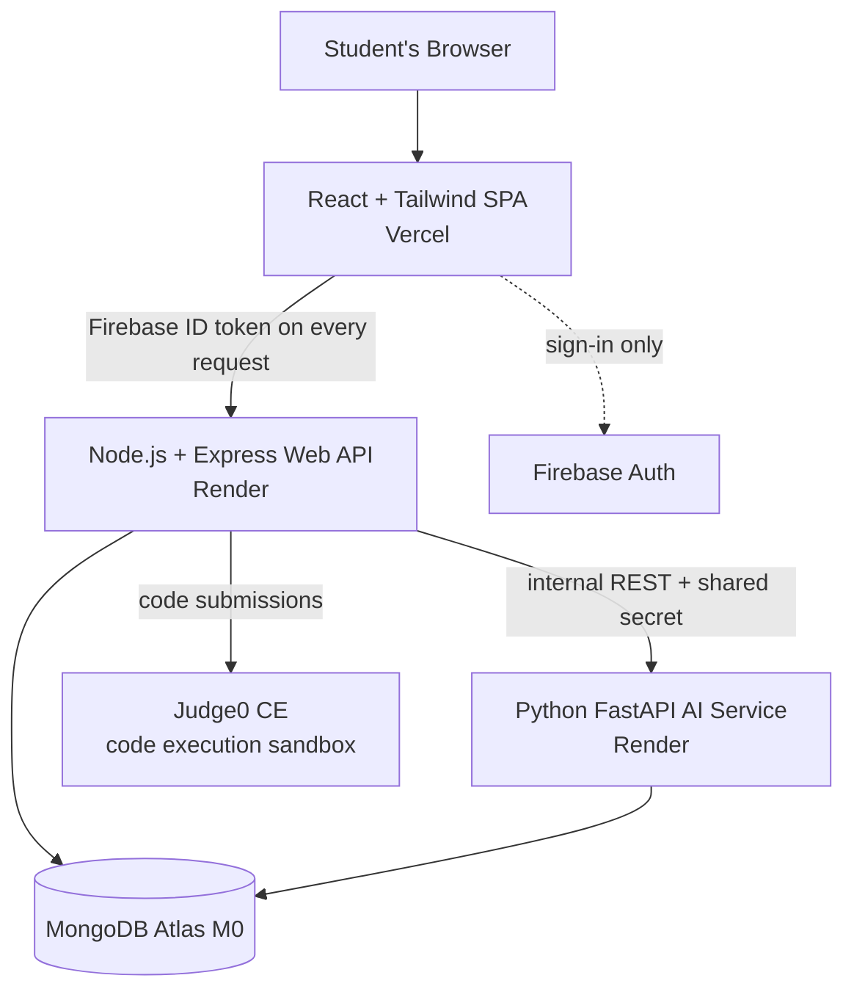

# SkillQuest — Technical Requirements Document (TRD)

| | |
|---|---|
| **Version** | 1.0 |
| **Depends on** | [01-PRD.md](01-PRD.md) — feature scope is defined there; this doc defines *how* it's built |
| **Audience** | The dev team. Every technology decision and integration contract lives here. |

---

## 1. System Architecture



**Rule: the browser talks only to the Web API** (plus Firebase for sign-in). The AI service and Judge0 are never called directly from the frontend — the Web API is the single gateway. This keeps auth, rate limiting, and logging in one place.

### Service responsibilities

| Service | Owns | Never does |
|---|---|---|
| **Frontend** (React) | UI, routing, Monaco editor, roadmap visualization, calling Web API | Business logic, direct DB/AI/Judge0 access |
| **Web API** (Node/Express) | Auth verification, users, levels, submissions, XP/streaks/badges, leaderboard, events log, proxying to Judge0 and AI service | ML inference, embeddings |
| **AI Service** (FastAPI) | Goal mapping (embeddings), roadmap generation, dropout scoring, placement scoring | Auth (trusts Web API via shared secret), direct user traffic |

## 2. Tech Stack (locked)

| Layer | Choice | Notes |
|---|---|---|
| Frontend | React 18 + Vite + Tailwind CSS | Vite, not CRA (CRA is deprecated) |
| Editor | `@monaco-editor/react` | Java syntax highlighting built in |
| State/data | React Query + Context | No Redux — overkill at this size |
| Web API | Node 20 LTS + Express 4 | |
| AI Service | Python 3.11 + FastAPI + Uvicorn | |
| DB | MongoDB Atlas M0 (free, 512 MB) | Single cluster, two logical groupings of collections (platform + ai) |
| Auth | Firebase Authentication (Spark) | Email/password + Google. Web API verifies ID tokens with `firebase-admin` |
| Code execution | Judge0 CE | Via RapidAPI free tier first; self-hosted on a VM/Render as fallback (see §5) |
| Embeddings | `all-MiniLM-L6-v2` via **fastembed** (ONNX) | NOT full PyTorch `sentence-transformers` — Render free tier has 512 MB RAM; torch alone exceeds it. fastembed runs the same model in ~150 MB |
| ML | scikit-learn (Random Forest), pandas | Trained offline in notebooks; model shipped as a `joblib` artifact inside the AI service image |
| Deploy | Vercel (FE) + Render free (API, AI) | Render free services cold-start after 15 min idle — see §9 |

## 3. Repository Structure (monorepo — this repo)

```
SKILLQUEST-DEV/
├── docs/            # All project documents (PRD, TRD, flows, schema, plans)
├── frontend/        # React SPA
├── backend/         # Node/Express Web API
├── ai-service/      # FastAPI service + trained model artifacts
├── ml/              # OULAD notebooks, training scripts, experiments (not deployed)
└── content/         # Level definitions: problems, starter code, test cases (JSON)
```

`content/` is deliberately outside `backend/`: levels are authored as JSON files, reviewed in PRs like code, and loaded into MongoDB by a seed script. This gives version control + review over the 40–50 levels.

## 4. Authentication Flow

1. Frontend signs in via Firebase SDK → receives an **ID token** (JWT, ~1 h expiry, SDK auto-refreshes).
2. Every Web API request carries `Authorization: Bearer <idToken>`.
3. Express middleware verifies the token with `firebase-admin`, attaches `uid`, and looks up/creates the user document (`users.firebaseUid`).
4. Web API → AI service calls carry `X-Internal-Key: <shared secret>` (env var on both services). The AI service rejects requests without it.
5. Admin routes (risk dashboard, level seeding) gated by an `isAdmin` flag on the user document — set manually in Atlas for the 3 team members.

## 5. Judge0 Integration (code execution)

- **Language**: Java — Judge0 CE `language_id: 62` (OpenJDK). Submission must contain a `public class Main` with `main()`; the level's starter code always provides this scaffold so students only fill in methods.
- **Flow**: Web API `POST /submissions?base64_encoded=true&wait=true` with `source_code`, `stdin`, `expected_output` per test case → synchronous result. If `wait=true` is unavailable/slow, fall back to token polling every 500 ms (max 10 s).
- Test cases run as **separate Judge0 submissions** (batch endpoint) so we can report per-case pass/fail.
- **Resource limits per run**: CPU time 5 s, wall 10 s, memory 256 MB (JVM needs headroom; Python-style 128 MB limits will fail Java).
- **Latency expectation**: JVM startup makes Java runs ~1.5–3 s. UI must show a "Running tests…" state; PRD's 3 s round-trip target applies to *platform* APIs, Judge0 time is shown to the user as execution time.
- **Rate limits**: RapidAPI free tier is ~50 requests/day — fine for dev, not for user testing or demos. **Before week 10, self-host Judge0 CE** (Docker, needs a small VM; Render doesn't support privileged containers — use a free Oracle Cloud VM or a college server). This is on the critical path in the implementation plan.
- **Security**: our servers never execute user code. All submissions are sandboxed inside Judge0. The Web API additionally caps submission size (64 KB) and strips level test data from client responses (hidden test cases stay hidden).

## 6. AI Service — Module Contracts

All endpoints internal (called by Web API only), JSON in/out.

### 6.1 Goal Mapper — `POST /ai/goal-map`
- In: free-text goal string. Out: `{goalCategory, confidence}`.
- Method: embed the text with fastembed → cosine similarity against pre-computed embeddings of ~10 goal-category description paragraphs (service-based placement, product companies, higher studies, etc.) → argmax with a confidence floor (below 0.35 → `general_placement` default).

### 6.2 Roadmap Generator — `POST /ai/roadmap`
- In: `{skillLevel, hoursPerWeek, quizResults, goalCategory}`. Out: ordered week-by-week plan of skill-node IDs.
- Method: load the skill DAG (from `skills` collection) → drop nodes tested out via quiz → **topological sort** (Kahn's algorithm) → greedy bin-packing of node `estimatedMinutes` into weekly buckets of `hoursPerWeek × 60`. Deterministic and fully explainable in the viva.

### 6.3 Dropout Scorer — `POST /ai/dropout-score` (+ weekly batch)
- **Offline**: Random Forest trained on **OULAD** in `ml/` notebooks. Labels: `Withdrawn`/`Fail` = at-risk. Features engineered to a schema *we can also compute from our own events log*:

| Feature | OULAD source | SkillQuest source |
|---|---|---|
| active_days_last_14 | studentVle clicks | events log |
| mean_session_gap_days | studentVle | events log |
| completion_ratio | assessments submitted/expected | levels completed/scheduled |
| avg_score | assessment scores | test-case pass ratio |
| streak_current / streak_broken_count | – (derived) | gamification data |
| days_since_last_login | studentVle | events log |

- Report **precision/recall/F1 per class + ROC-AUC** on a held-out split; compare with 2–3 published OULAD papers.
- **Online**: a weekly job (Render cron, or a `node-cron` task in the Web API) computes the feature row per student → AI service loads `dropout_rf.joblib` → probability → tiers: **At Risk** (>0.65), **Watch** (0.35–0.65), **Healthy** (<0.35). Tier changes to At Risk trigger the nudge (F5 in PRD).

### 6.4 Placement Scorer — `POST /ai/placement-score`
- In: student's completed skill IDs + target companies. Out: per-company `{score 0–100, missingSkills[]}`.
- Method: each company profile is a curated list of weighted skills (from public JDs, stored in `companyProfiles`). Score = weighted coverage of the profile by completed skills, with embedding similarity used to match skill names to JD phrasing (so "recursion" matches "recursive problem solving"). Gap list = highest-weight uncovered skills.

## 7. Events Log (the backbone)

Every meaningful action writes one document to `events`: `{userId, type, payload, ts}`. Types: `login`, `level_start`, `level_submit`, `level_complete`, `hint_used`, `streak_break`, `badge_earned`, `roadmap_view`. Append-only, indexed on `(userId, ts)`. This single collection feeds dropout features, streak calculation, and the admin dashboard — it must be written from day one, even before the dropout model exists.

## 8. Non-Functional Requirements

- **Performance**: p95 < 500 ms for Web API endpoints (excluding Judge0 passthrough). Pagination on leaderboard/levels lists.
- **Security**: all secrets in env vars (never committed — `.env` in `.gitignore`); CORS locked to the Vercel domain; `express-rate-limit` on submission endpoints (10/min/user); input validation with `zod` (Node) and Pydantic (FastAPI); Firebase token verification on every non-public route.
- **Storage budget**: Atlas M0 = 512 MB. Events log is the growth risk — at UAT scale (~30 users × ~200 events) it's trivial; no TTL needed this semester, but document the concern in the report.
- **Availability**: free tiers only; cold starts accepted in dev. For demos/UAT: a warm-up ping (GitHub Actions cron hitting `/health` every 10 min on both Render services during demo weeks).

## 9. Environments & Deployment

| Env | Frontend | Web API | AI Service | DB |
|---|---|---|---|---|
| Local dev | Vite :5173 | :4000 | :8000 | Atlas shared `dev` database |
| Production | Vercel | Render | Render | Atlas `prod` database |

- Deploy = push to `main` (Vercel + Render auto-deploy).
- **Branch workflow**: `main` is protected by convention — work on feature branches (`feat/<name>`), open PRs, at least one teammate reviews. CI (GitHub Actions): lint + `npm test` + `pytest` on every PR (kept minimal — smoke tests, not full coverage).

## 10. Open Technical Decisions (resolve during Backend Schema / Implementation Plan)

1. Exact skill DAG contents for Java + DSA (~15–20 skill nodes covering syntax → OOP → collections → recursion → sorting/searching → stacks/queues → linked lists → trees basics → interview patterns).
2. Judge0 self-host target (Oracle Cloud free VM vs college server) — decide by week 6.
3. Whether weekly dropout scoring runs as Render cron or in-process `node-cron` (leaning in-process: zero extra infra).
