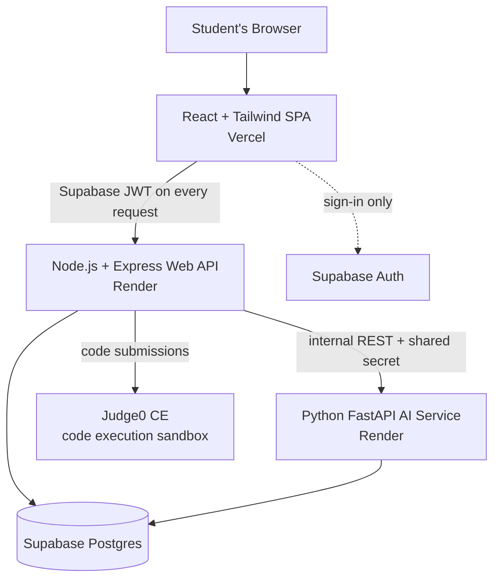

# SkillQuest — Technical Requirements Document (TRD)

| | |
|---|---|
| **Version** | 1.2 — review corrections: Node 22, DB credential model, Judge0 timing/scheduling, ML protocol, real goal personalization |
| **Depends on** | [01-PRD.md](01-PRD.md) — feature scope is defined there; this doc defines *how* it's built |
| **Audience** | The dev team. Every technology decision and integration contract lives here. |

---

## 1. System Architecture



**Rule: the browser talks only to the Web API** (plus Supabase Auth for sign-in). The AI service and Judge0 are never called directly from the frontend — the Web API is the single gateway. This keeps auth, rate limiting, and logging in one place.

### Service responsibilities

| Service | Owns | Never does |
|---|---|---|
| **Frontend** (React) | UI, routing, Monaco editor, roadmap visualization, calling Web API | Business logic, direct DB/AI/Judge0 access |
| **Web API** (Node/Express) | Auth verification, users, levels, submissions, XP/streaks/badges, leaderboard, events log, proxying to Judge0 and AI service | ML inference, embeddings |
| **AI Service** (FastAPI) | Goal mapping (embeddings), roadmap generation, dropout scoring, placement scoring | Auth (trusts Web API via shared secret), direct user traffic |

## 2. Tech Stack (locked)

| Layer | Choice | Notes |
|---|---|---|
| Frontend | React 18 + Vite + Tailwind CSS | Vite, not CRA (CRA is deprecated) |
| Editor | `@monaco-editor/react` | Java syntax highlighting built in |
| State/data | React Query + Context | No Redux — overkill at this size |
| Web API | Node 22 LTS + Express 4 | Node 20 reached end-of-life in April 2026 — do not use it |
| AI Service | Python 3.11 + FastAPI + Uvicorn | |
| DB | Supabase free tier — Postgres (500 MB) | Relational schema; SQL aggregations power dropout features and the leaderboard; pgvector available for embeddings |
| Auth | Supabase Auth | Email/password + Google. Web API verifies the Supabase JWT — no Firebase anywhere |
| DB access | Prisma (Web API) · psycopg + pandas (AI service) | Both connect over **standard PostgreSQL credentials** (a connection string with a DB role + password), *not* the Supabase service-role API key — that key is for Supabase's REST/JS client, which we don't use server-side. Always via the pooled connection string (Supavisor, port 6543); the free tier allows very few direct connections |
| Code execution | Judge0 CE | Via RapidAPI free tier first; self-hosted on a VM/Render as fallback (see §5) |
| Embeddings | `all-MiniLM-L6-v2` via **fastembed** (ONNX) | NOT full PyTorch `sentence-transformers` — Render free tier has 512 MB RAM; torch alone exceeds it. fastembed runs the same model in ~150 MB |
| ML | scikit-learn (Random Forest), pandas | Trained offline in notebooks; model shipped as a `joblib` artifact inside the AI service image |
| Deploy | Vercel (FE) + Render free (API, AI) | Render free services cold-start after 15 min idle — see §9 |

## 3. Repository Structure (monorepo — this repo)

```
SKILLQUEST-DEV/
├── docs/            # All project documents (PRD, TRD, flows, schema, plans)
├── frontend/        # React SPA
├── backend/         # Node/Express Web API
├── ai-service/      # FastAPI service + trained model artifacts
├── ml/              # OULAD notebooks, training scripts, experiments (not deployed)
└── content/         # Level definitions: problems, starter code, test cases (JSON)
```

`content/` is deliberately outside `backend/`: levels are authored as JSON files, reviewed in PRs like code, and loaded into the database by a seed script. This gives version control + review over the 40–50 levels.

## 4. Authentication Flow

1. Frontend signs in via `supabase-js` (email/password or Google) → receives a Supabase **access token** (JWT, ~1 h expiry, SDK auto-refreshes). Google sign-in needs a one-time Google Cloud OAuth client configured in the Supabase dashboard.
2. Every Web API request carries `Authorization: Bearer <accessToken>`.
3. Express middleware verifies the JWT with the project's `SUPABASE_JWT_SECRET` (HS256), reads the `sub` claim (the `auth.users` UUID), and looks up/creates the matching row in our `profiles` table (`profiles.id` = that UUID).
4. **The browser uses Supabase for auth only.** The anon key grants no table access (RLS enabled with no public policies) — all data flows through the Web API, which connects to Postgres with its own least-privilege DB role (§4.1).
5. Web API → AI service calls carry `X-Internal-Key: <shared secret>` (env var on both services). The AI service rejects requests without it. **The browser never calls `/ai/*` directly** — every AI call is server-to-server behind the Web API gateway.
6. Admin routes (risk dashboard, level seeding) gated by an `is_admin` flag on the profile row — set manually in the Supabase dashboard for the 3 team members.

### 4.1 Post-onboarding routing

Route on **`profiles.onboarding_step`**, not on whether a profile row exists — step 3 creates the profile automatically on first login, so "profile exists?" is always true by the time the frontend asks. Rule: `onboarding_step < 5` → `/onboarding` (resume at that step); `== 5` → the requested route.

### 4.2 Database roles (least privilege)

Two Postgres roles, created in the initial migration:

| Role | Grants | Used by |
|---|---|---|
| `skillquest_api` | `SELECT/INSERT/UPDATE` on application tables; no `DROP`/`ALTER` | Web API (Prisma runtime) |
| `skillquest_ai` | `SELECT` on `events`, `user_levels`, `submissions`, `profiles`, `skills`; `INSERT` on `dropout_scores`, `placement_scores` | AI service |

Migrations run under a separate owner role, not the runtime roles. This is cheap to set up and means a leaked service credential can't drop tables.

## 5. Judge0 Integration (code execution)

- **Language**: Java (OpenJDK). **Query `GET /languages` at startup and resolve the Java id at runtime** — `language_id: 62` is correct for common Judge0 CE builds but varies by provider and version; never hardcode it. Cache the resolved id. Submission must contain a `public class Main` with `main()`; the level's starter code always provides this scaffold so students only fill in methods.
- **Flow**: Web API `POST /submissions/batch?base64_encoded=true` with one submission per test case (`source_code`, `stdin`, `expected_output`) → poll tokens every 500 ms until all complete (cap 20 s, then surface a timeout). Batch keeps per-case pass/fail while paying JVM startup once per case in parallel rather than serially.
- **Resource limits per run**: CPU time 5 s, wall 10 s, memory 256 MB (JVM needs headroom; Python-style 128 MB limits will fail Java).
- **Latency expectation (measured target, not aspiration)**: JVM startup is ~1.5–3 s *per case*; a level with 5 test cases realistically takes **5–12 s wall clock**. Requirement is therefore: **UI acknowledges the click in < 200 ms** (button → "Running tests…", editor locks) and **p95 end-to-end test run < 15 s**. Record actual p95 during UAT and report it. The old "3 s per run" target was infeasible and has been removed.
- **Capacity**: RapidAPI free tier is ~50 requests/day — that is roughly **10 level attempts**, so it is a dev-only stopgap. **Self-host Judge0 CE and load-test it by week 6** (Docker + privileged containers, so a free Oracle Cloud VM or a college server — Render cannot host it). Load test = 5 concurrent users × 5 test cases, measure p95. Verify current free-tier limits for RapidAPI, Oracle Cloud, Render and Supabase before committing, as they change.
- **Security**: our servers never execute user code. All submissions are sandboxed inside Judge0. The Web API additionally caps submission size (64 KB) and strips level test data from client responses (hidden test cases stay hidden).

## 6. AI Service — Module Contracts

All endpoints internal (called by Web API only), JSON in/out.

### 6.1 Goal Mapper — `POST /ai/goal-map`
- In: free-text goal string. Out: `{goalCategory, confidence}`.
- Method: embed the text with fastembed → cosine similarity against pre-computed embeddings of ~10 goal-category description paragraphs (service-based placement, product companies, higher studies, etc.) → argmax with a confidence floor (below 0.35 → `general_placement` default).

### 6.2 Roadmap Generator — `POST /ai/roadmap`
- In: `{skillLevel, hoursPerWeek, quizResults, goalCategory}`. Out: ordered week-by-week plan of skill-node IDs.
- Method: load the skill DAG (from the `skills` table) → drop nodes tested out via quiz → **topological sort** (Kahn's algorithm) → greedy bin-packing of node `estimatedMinutes` into weekly buckets of `hoursPerWeek × 60`. Deterministic and fully explainable in the viva.

### 6.3 Disengagement Risk Scorer — `POST /ai/risk-score` (+ weekly batch)

> **Naming and claim discipline.** This module is an **experimental transfer-based disengagement risk indicator**, not a validated dropout predictor for our population. OULAD is UK adult distance-learning; SkillQuest users are Indian undergraduates doing coding practice. Every report sentence, chart caption and viva answer must carry that qualifier. We may claim: the model discriminates at-risk learners *on OULAD*, and the same feature pipeline runs live on SkillQuest. We may **not** claim it is validated on our users, nor that interventions reduce dropout (see §6.3.6).

#### 6.3.1 Prediction task (state it exactly)

> Given a learner's activity in a **28-day observation window** ending at time *T*, predict whether they will be **disengaged during the 21 days following *T*** (the prediction horizon).

- **Observation window:** 28 days. **Horizon:** 21 days. Both fixed; both stored with every prediction.
- Nothing after *T* may enter the features. Final course outcome, total clicks, and end-of-course assessment scores are **leakage** and are excluded by construction.

#### 6.3.2 Labels (Withdrawn ≠ Fail)

The previous "`Withdrawn` OR `Fail` = at-risk" definition was wrong: failing a course is an *achievement* outcome, not a *disengagement* outcome, and mixing them teaches the model two different things at once.

| Setting | Positive label | Excluded |
|---|---|---|
| **OULAD (training)** | `final_result = Withdrawn` **and** `date_unregistration` falls inside the horizon | `Fail` rows are **not** positives. Train the primary model on Withdrawn-vs-rest |
| **SkillQuest (live)** | No activity event for ≥ 21 consecutive days | — |

Report the `Fail`-included variant as a **secondary experiment** for comparison, clearly labelled — do not present it as the headline.

#### 6.3.3 Splits (this is what an examiner will probe)

- **Grouped by student** — a student appears in exactly one split. Use `GroupShuffleSplit` / `StratifiedGroupKFold` on `id_student`. Never a plain random row split; a student contributes multiple windows and leakage across splits inflates every metric.
- **Time/presentation-based holdout** — train on earlier course presentations (e.g. 2013B/2013J), test on a later one (2014J). This mimics deployment: predicting learners you have never seen, in a period you did not train on.
- Report both protocols. The grouped-random one flatters; the temporal one is honest. Lead with the temporal number.

#### 6.3.4 Baselines (mandatory — the model must beat these)

| Baseline | Why it exists |
|---|---|
| Majority class | Floor. Shows accuracy alone is meaningless on imbalanced data |
| **Days-since-last-activity threshold** | The one that matters. A single rule — "inactive > N days" — is a strong disengagement predictor |
| Logistic regression on the same features | Shows whether the Random Forest's nonlinearity earns its complexity |

**If Random Forest does not clearly beat the inactivity threshold, that is the finding — report it.** An honest "our RF adds +4 points of PR-AUC over a one-line rule" is a stronger result than an unexplained 91%, and it is defensible under questioning.

#### 6.3.5 Metrics

- **PR-AUC (primary)** — the positive class is rare, so precision/recall trade-off is what matters; ROC-AUC looks optimistic under imbalance.
- Confusion matrix, precision/recall/F1 per class, ROC-AUC secondary.
- **Threshold selection is a documented decision, not a default.** Pick the operating point on the validation set for the intervention's cost profile (a false positive = an unnecessary encouraging nudge, which is cheap; a false negative = a student we fail to reach). Report the chosen threshold and why.
- Report class balance and the trivial-baseline accuracy alongside every number, so no figure can be read out of context.
- Compare against 2–3 published OULAD papers, noting **their** task definition and split protocol — numbers are only comparable if the task matches.

#### 6.3.6 What may not be claimed

With 20–30 UAT students over a few weeks: report **interaction behaviour** (nudges shown, clicked, dismissed; what students did next). Do **not** claim reduced dropout, causal intervention effectiveness, or local model validation. There is no control group and the sample is far too small. State this as a limitation in the report — examiners respect a stated limitation far more than an overclaim they have to expose.

#### 6.3.7 Features

Engineered so the *same* schema is computable from OULAD and from our events log:

| Feature | OULAD source | SkillQuest source |
|---|---|---|
| active_days_in_window | studentVle clicks | events log |
| mean_session_gap_days | studentVle | events log |
| days_since_last_activity | studentVle | events log |
| completion_ratio | assessments submitted / expected to date | levels completed / scheduled to date |
| avg_score | assessment scores to date | test-case pass ratio |
| activity_trend | clicks 2nd half vs 1st half of window | same |
| streak_current / streak_broken_count | – (derived) | gamification data |

Every feature is computed **strictly within the observation window**. The transfer assumption (that these carry equivalent meaning across the two populations) is documented as a limitation, not asserted as fact.

#### 6.3.8 Online scoring & reproducibility

A weekly external-scheduler job (§10.3) computes each student's feature row → AI service loads `risk_rf.joblib` → probability → tiers: **At Risk** (> 0.65), **Watch** (0.35–0.65), **Healthy** (< 0.35).

Every row written to `dropout_scores` must record enough to **reproduce the exact number printed in the report**: `model_version`, `feature_set_version`, `observation_window_start`, `observation_window_end`, `prediction_horizon_days`, `threshold_version`, the `features` snapshot, and `scored_at`. Without these, a figure in the report cannot be traced back to a model and is not defensible.

### 6.4 Placement Scorer — `POST /ai/placement-score`
- In: student's completed skill IDs + target companies. Out: per-company `{score 0–100, missingSkills[]}`.
- Method: each company profile is a curated list of weighted skills stored in `companies` + `company_skills` (schema §3.11). **Embeddings are used at ingestion time only** — when a team member maps a JD phrase ("recursive problem solving") to a canonical `skill_id` (`recursion`), embedding similarity suggests the match and a human confirms it. Once mapped, scoring is **pure weighted coverage arithmetic**: `score = 100 × Σ(weight of covered skills) / Σ(all weights)`. No runtime embedding calls.
- This matters for the viva: the score is deterministic, reproducible, and explainable line by line ("you have 7 of the 11 weighted requirements"). Runtime similarity would add latency and non-determinism for no accuracy gain, since the mapping is already canonical.
- Out: per-company `{score, coveredSkills[], missingSkills[]}` where each missing skill is tagged `available_now` (a roadmap node exists) or `external_track` (SkillQuest doesn't teach it yet).

## 7. Events Log (the backbone)

Every meaningful action writes one row to the `events` table: `(user_id, type, payload jsonb, ts)`. Types: `login`, `level_start`, `level_submit`, `level_complete`, `hint_used`, `streak_break`, `badge_earned`, `roadmap_view`. Append-only, indexed on `(user_id, ts)`. Weekly dropout features become a single SQL `GROUP BY` over this table. This single table feeds dropout features, streak calculation, and the admin dashboard — it must be written from day one, even before the dropout model exists.

## 8. Non-Functional Requirements

- **Performance**: p95 < 500 ms for Web API endpoints (excluding Judge0 passthrough). Pagination on leaderboard/levels lists.
- **Security**: all secrets in env vars (never committed — `.env` in `.gitignore`); CORS locked to the Vercel domain; `express-rate-limit` on submission endpoints (10/min/user); input validation with `zod` (Node) and Pydantic (FastAPI); Supabase JWT verification on every non-public route.
- **Storage budget**: Supabase free tier = 500 MB Postgres. Events log is the growth risk — at UAT scale (~30 users × ~200 events) it's trivial; no pruning needed this semester, but document the concern in the report.
- **Availability**: free tiers only; cold starts accepted in dev. **Supabase free projects pause after 7 days of inactivity** — the Web API `/health` endpoint runs a trivial DB query, and a GitHub Actions cron pings `/health` on both Render services (every 10 min during demo/UAT weeks, daily otherwise), which keeps Render warm *and* Supabase unpaused with one mechanism.

## 9. Environments & Deployment

| Env | Frontend | Web API | AI Service | DB |
|---|---|---|---|---|
| Local dev | Vite :5173 | :4000 | :8000 | Supabase project `skillquest-dev` |
| Production | Vercel | Render | Render | Supabase project `skillquest-prod` |

The free tier allows two projects per organization — exactly one for dev, one for prod. Schema changes go through Prisma migrations committed to the repo, applied to dev first, prod on release.

- Deploy = push to `main` (Vercel + Render auto-deploy).
- **Branch workflow**: `main` is protected by convention — work on feature branches (`feat/<name>`), open PRs, at least one teammate reviews. CI (GitHub Actions): lint + `npm test` + `pytest` on every PR (kept minimal — smoke tests, not full coverage).

## 10. Open Technical Decisions (resolve during Backend Schema / Implementation Plan)

1. Exact skill DAG contents for Java + DSA (~15–20 skill nodes covering syntax → OOP → collections → recursion → sorting/searching → stacks/queues → linked lists → trees basics → interview patterns).
2. Judge0 self-host target (Oracle Cloud free VM vs college server) — decide by week 6.
3. ~~Whether weekly dropout scoring runs as Render cron or in-process `node-cron`.~~ **Resolved: external scheduler.** `node-cron` cannot fire while a free Render service is asleep (which it will be, most of the time). A GitHub Actions scheduled workflow calls an authenticated `POST /internal/jobs/weekly-scoring` endpoint, which wakes the service. The job takes an advisory lock (`pg_try_advisory_lock`) and is idempotent per `(user_id, window_end)` so a retry or double-fire cannot double-score.
