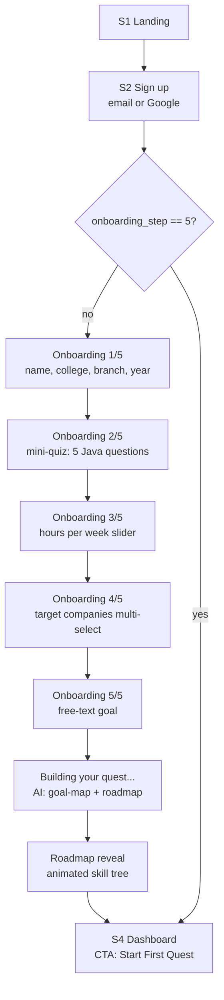
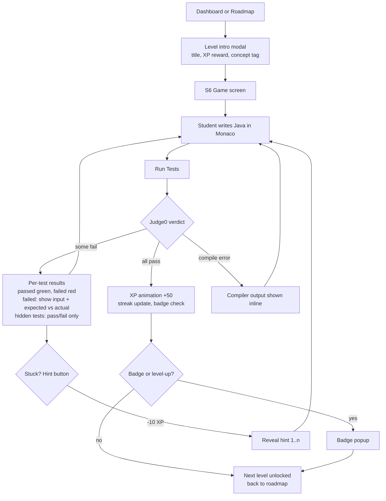

# SkillQuest — App Flow

| | |
|---|---|
| **Version** | 1.0 |
| **Depends on** | [01-PRD.md](01-PRD.md) (features), [02-TRD.md](02-TRD.md) (architecture) |
| **Purpose** | Every screen, every journey, every state — the blueprint the UI/UX design doc turns into mockups |

---

## 1. Screen Inventory (routes)

| # | Route | Screen | Auth | Priority |
|---|---|---|---|---|
| S1 | `/` | Landing page | Public | P0 |
| S2 | `/auth` | Sign up / Login (Supabase Auth) | Public | P0 |
| S3 | `/onboarding` | Onboarding wizard (5 steps) | Auth, first-time only | P0 |
| S4 | `/dashboard` | Home — streak, XP, next quest, risk nudges | Auth | P0 |
| S5 | `/roadmap` | Interactive skill-tree roadmap | Auth | P0 |
| S6 | `/play/:levelId` | Game screen — problem + Monaco editor | Auth | P0 |
| S7 | `/placement` | Placement readiness tracker | Auth | P0 |
| S8 | `/profile` | Profile & settings (hours/week, targets, badges) | Auth | P0 |
| S9 | `/leaderboard` | Weekly XP leaderboard | Auth | P1 |
| S10 | `/admin` | Admin — risk tiers, level management | Admin flag | P0 (internal, unstyled OK) |

Global chrome (S4–S9): top bar with XP count, streak flame 🔥, avatar menu; left nav on desktop, bottom tabs on mobile.

## 2. Flow A — First-Time User (the make-or-break flow)

**Details:**
- **Routing:** the profile row is created automatically on first login (TRD §4), so "does a profile exist" is always true and cannot gate onboarding. **Route on `profiles.onboarding_step`**: `< 5` → resume onboarding at that step, `== 5` → dashboard.
- **Mini-quiz (O2):** **12 auto-graded MCQs — 3 per testable topic** (variables/types, loops, methods, OOP basics). A student tests out of a topic only by scoring **3/3** on it; 2/3 or lower keeps the node in the roadmap. One question can never skip a whole topic — the false-positive rate is far too high, and a wrongly-skipped fundamental breaks every later level that depends on it. Persist every attempt (`quiz_attempts`: question id, question version, chosen answer, correct, timestamp) so results are reproducible and the quiz itself can be evaluated in the report.
- **Free-text goal (O5):** placeholder text shows an example ("e.g., I want to crack the Infosys interview and get into a product company later"). Skippable — skipping assigns `general_placement`.
- **Processing (P):** the frontend calls **one Web API endpoint** (`POST /api/onboarding/complete`); the Web API then calls `/ai/goal-map` and `/ai/roadmap` server-to-server. The browser never calls `/ai/*` directly (TRD §1 gateway rule). Show a themed loading animation (~2–4 s). On AI-service failure: fall back to the default roadmap for their quiz level — the user must never be stranded here.
- **Roadmap reveal (R):** the moment of delight — tree animates in, first node pulsing "Start here". This screen is the demo highlight; budget design time for it.
- Every step writes an `event` (`onboarding_step`, payload = step number) — abandonment here is itself dropout data.

## 3. Flow B — Play a Level (the core loop)

**Game screen (S6) layout:** left panel = problem statement, examples, constraints; right panel = Monaco (Java, dark theme) with starter code; bottom = Run Tests button + results drawer. Timer runs silently (analytics only — no visible countdown; time pressure kills learning).

**States that must exist:** running (spinner on button, editor locked), Judge0 timeout/unavailable ("Our code runner is busy — try again in a minute", submission NOT counted), network lost (local draft of code kept in `localStorage` so work is never lost).

**Events written:** `level_start`, `level_submit` (with pass ratio), `hint_used`, `level_complete`.

## 4. Flow C — Placement Tracker

1. From dashboard card ("Placement Readiness: 62% coverage ▲") or nav → S7.
2. S7 shows per-role coverage cards (Infosys 71%, TCS 68%, …), each with the standing subtitle *"Based on published requirements currently represented in SkillQuest. Not a hiring prediction."* and the JD source link + collection date.
3. Tap a role → **full** gap list, ranked by weight, in two groups:
   - **Available now** — "Train this →" deep-links to `/roadmap?focus=<skillId>`.
   - **External / future track** — informational row, muted styling, **no action button** (SkillQuest doesn't teach it yet). Never render a button that leads nowhere.
4. Coverage recomputes after every `level_complete` (Web API calls the AI service server-side; dashboard card shows the delta since last week).

## 5. Flow D — Dropout Intervention (invisible until triggered)

1. Weekly job computes features → AI service scores → tier stored on user doc.
2. Tier transitions to **At Risk** → next dashboard visit renders a nudge card *instead of* the standard next-quest card: warm message ("Your streak misses you 🔥") + a **confidence booster** — an easier level from an already-passed concept, worth full XP.
3. If the student doesn't log in at all for 5+ days: email nudge (P1) — max 1 email/week, never guilt-based wording.
4. Nudge card interaction (or dismissal) → `event` — this measures whether interventions actually work, which is a headline chart for the final report.

## 6. Flow E — Streak Mechanics (background)

- "Active day" = ≥1 `level_submit` event (not just login — logging in isn't learning).
- Dashboard streak flame states: lit (active today), **amber pulse** (inactive today, streak at stake — shown after 6 pm), grey (broken).
- Streak break → sympathetic message + "Best streak: N days" preserved on profile. Never shame.

## 7. Flow F — Admin (S10, internal)

- Table of users: risk tier, streak, levels completed, last active. Sort by risk.
- Level management: list levels from `content/` seed, toggle `published`.
- Trigger buttons (dev only): "Run weekly scoring now", "Recompute placement scores" — needed for demos so we don't wait a week to show the dropout pipeline live.

## 8. Edge Cases & Empty States (checklist for UI/UX doc)

| Situation | Behaviour |
|---|---|
| Roadmap with everything completed | Celebration screen + pointer to stretch content / leaderboard |
| Changed hours/week in settings | Confirm dialog → roadmap re-packs remaining weeks (completed nodes untouched) |
| Re-running onboarding | Not allowed in v1; settings expose hours + companies only |
| Judge0 down during play | Friendly error, retry button, submission not counted as failed |
| AI service down at onboarding | Default roadmap fallback (silent, logged) |
| Leaderboard with <5 users | Hide ranks, show "Early adopter" framing |
| Brand-new user on dashboard | Zero-state: single big "Start your first quest" CTA, no empty widgets |
| Token expired mid-session | supabase-js auto-refreshes; on hard 401 → redirect `/auth` preserving return URL |

## 9. Navigation Rules

- Unauthenticated hit on any auth route → `/auth?next=<route>`.
- Authenticated but `onboarding_step < 5` → force-redirect to `/onboarding`, resuming at that step (progress saved server-side after each step). Never gate on profile existence.
- `/play/:levelId` for a locked level → redirect to roadmap with a "finish the previous quest" toast (prevents URL-sharing skips).
- Admin routes: `isAdmin` check server-side on every API call, not just hidden nav.
