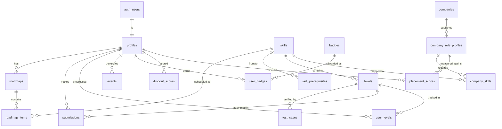

# SkillQuest — Backend Schema

| | |
|---|---|
| **Version** | 1.0 |
| **Depends on** | [02-TRD.md](02-TRD.md) (Supabase Postgres + Prisma), [03-APP-FLOW.md](03-APP-FLOW.md) (what data each screen needs) |
| **Purpose** | The Postgres schema — tables, relationships, indexes, and the reasoning behind them. This is what Prisma migrations implement. |

---

## 1. Overview

PostgreSQL on Supabase. Auth lives in Supabase's managed `auth.users` table (we don't touch it); everything else is our `public` schema. Access is via **Prisma** from the Web API and **psycopg + pandas** from the AI service. Row Level Security is enabled on all tables with **no public policies** — the browser's anon key can read nothing; all data flows through the Web API using the service role.

Design rules:
- **UUIDs** for user-facing IDs (`profiles.id` mirrors `auth.users.id`); `bigint identity` for high-volume internal tables (`events`, `submissions`).
- **`snake_case`** columns (Postgres convention; Prisma maps to camelCase in JS via `@map`).
- **Timestamps** are `timestamptz`, default `now()`. Every table has `created_at`; mutable tables also `updated_at`.
- Skill content (levels, test cases) is authored as JSON in `content/` and loaded by a **seed script** — the DB is the runtime source, the JSON is the versioned source of truth.

## 2. Entity Relationship Diagram



## 3. Tables

### 3.1 `profiles` — the user (1:1 with `auth.users`)
```sql
create table profiles (
  id            uuid primary key references auth.users(id) on delete cascade,
  email         text not null,
  full_name     text,
  college       text,
  branch        text,
  year          int,
  skill_level   text default 'beginner',       -- beginner|intermediate|advanced (from quiz)
  hours_per_week int default 5,
  goal_text      text,                          -- raw free-text goal
  goal_category  text,                          -- AI-mapped category
  target_companies text[] default '{}',          -- company slugs
  total_xp       int not null default 0,
  current_streak int not null default 0,
  best_streak    int not null default 0,
  last_active_date date,
  onboarding_step int not null default 0,       -- 0..5; 5 = complete (resume support)
  risk_tier      text default 'healthy',        -- healthy|watch|atrisk (denormalized latest)
  is_admin       boolean not null default false,
  created_at     timestamptz not null default now(),
  updated_at     timestamptz not null default now()
);
```
`total_xp`, `current_streak`, `risk_tier` are **denormalized** from events/scores for fast dashboard reads — the events log stays the source of truth, these are cached rollups updated on write.

### 3.2 `skills` — the DAG nodes
```sql
create table skills (
  id               text primary key,            -- 'recursion', 'loops' (human-readable, stable)
  title            text not null,
  description      text,
  concept_type     text not null,               -- 'conceptual' | 'practical' (informs level style)
  estimated_minutes int not null default 60,     -- for roadmap bin-packing
  display_order    int not null default 0,
  created_at       timestamptz not null default now()
);
```

### 3.3 `skill_prerequisites` — the DAG edges
```sql
create table skill_prerequisites (
  skill_id      text not null references skills(id) on delete cascade,
  prereq_id     text not null references skills(id) on delete cascade,
  primary key (skill_id, prereq_id),
  check (skill_id <> prereq_id)
);
```
The roadmap generator (TRD §6.2) topologically sorts skills using these edges. A `check` prevents self-loops; the seed script must validate the whole graph is acyclic before loading.

### 3.4 `levels` — the playable content
```sql
create table levels (
  id             text primary key,             -- 'recursion-03'
  skill_id       text not null references skills(id) on delete cascade,
  title          text not null,
  difficulty     int not null default 1,       -- 1..5, ordering within a skill
  statement_md   text not null,                -- problem statement (markdown)
  starter_code   text not null,                -- Java scaffold with public class Main
  reference_solution text,                      -- authors' solution (never sent to client)
  hints          text[] default '{}',           -- ordered; each costs XP
  xp_reward      int not null default 50,
  time_limit_ms  int not null default 5000,     -- Judge0 CPU limit
  published      boolean not null default false,
  order_in_skill int not null default 0,
  created_at     timestamptz not null default now()
);
```

### 3.5 `test_cases` — Judge0 verification
```sql
create table test_cases (
  id            bigint generated always as identity primary key,
  level_id      text not null references levels(id) on delete cascade,
  stdin         text not null default '',
  expected_output text not null,
  is_hidden     boolean not null default false,  -- hidden cases: pass/fail only to client
  weight        int not null default 1,
  ordinal       int not null default 0
);
```
**Security-critical:** the Web API strips `expected_output` and hidden-case data before responding to the client (TRD §5). Only pass/fail leaks for hidden cases.

### 3.6 `roadmaps` & `roadmap_items` — the personalized plan
```sql
create table roadmaps (
  id          bigint generated always as identity primary key,
  user_id     uuid not null references profiles(id) on delete cascade,
  generated_at timestamptz not null default now(),
  is_active   boolean not null default true,     -- regenerated on hours/week change
  params      jsonb                              -- snapshot of inputs (level, hours, goal) for reproducibility
);

create table roadmap_items (
  id          bigint generated always as identity primary key,
  roadmap_id  bigint not null references roadmaps(id) on delete cascade,
  skill_id    text not null references skills(id),
  week_number int not null,
  position    int not null,                      -- order within the week
  status      text not null default 'locked'     -- locked|current|completed
);
```
Regenerating a roadmap (hours/week change) marks the old one `is_active=false` and inserts a new one — history preserved for the report; completed-node status carries over.

### 3.7 `user_levels` — per-level progress
```sql
create table user_levels (
  user_id      uuid not null references profiles(id) on delete cascade,
  level_id     text not null references levels(id) on delete cascade,
  status       text not null default 'locked',   -- locked|unlocked|completed
  best_pass_ratio numeric default 0,             -- 0..1, best test pass ratio
  hints_used   int not null default 0,
  attempts     int not null default 0,
  completed_at timestamptz,
  primary key (user_id, level_id)
);
```
Drives the "Code Master" badge (completed with `hints_used = 0`) and feeds `completion_ratio` / `avg_score` dropout features.

### 3.8 `submissions` — every code run
```sql
create table submissions (
  id           bigint generated always as identity primary key,
  user_id      uuid not null references profiles(id) on delete cascade,
  level_id     text not null references levels(id) on delete cascade,
  source_code  text not null,
  pass_ratio   numeric not null default 0,       -- passed / total test cases
  verdict      text not null,                    -- accepted|wrong_answer|compile_error|runtime_error|timeout
  runtime_ms   int,
  created_at   timestamptz not null default now()
);
```
Append-only. Capped at 64 KB source (TRD §5). High volume → `bigint` id, indexed on `(user_id, created_at)`.

### 3.9 `events` — the behavioral backbone (TRD §7)
```sql
create table events (
  id       bigint generated always as identity primary key,
  user_id  uuid not null references profiles(id) on delete cascade,
  type     text not null,                        -- login|level_start|level_submit|level_complete|hint_used|streak_break|badge_earned|roadmap_view|onboarding_step
  payload  jsonb not null default '{}',
  ts       timestamptz not null default now()
);
create index idx_events_user_ts on events(user_id, ts);
```
Weekly dropout features are one `GROUP BY user_id` over this table — the whole reason Postgres was chosen over Firestore.

### 3.10 `badges` & `user_badges`
```sql
create table badges (
  id          text primary key,                 -- 'first_quest','week_warrior','code_master','placement_ready'
  title       text not null,
  description text not null,
  icon        text,                             -- emoji or asset key
  criteria    text                              -- human description of unlock rule
);

create table user_badges (
  user_id    uuid not null references profiles(id) on delete cascade,
  badge_id   text not null references badges(id) on delete cascade,
  earned_at  timestamptz not null default now(),
  primary key (user_id, badge_id)
);
```
Badge rules live in Web API code (evaluated on relevant events), not the DB — the `badges` table is the catalog.

### 3.11 `companies` & `company_skills` — placement scoring source
```sql
create table companies (
  id          text primary key,                 -- 'infosys','tcs','wipro','accenture','cognizant'
  name        text not null,
  logo        text
);

-- One row per role profile per company, versioned and citable.
create table company_role_profiles (
  id            bigint generated always as identity primary key,
  company_id    text not null references companies(id) on delete cascade,
  role_title    text not null,                  -- 'Systems Engineer', 'Programmer Analyst'
  location      text,                           -- 'India', 'Bangalore'
  source_url    text not null,                  -- the public JD we curated from
  collected_on  date not null,                  -- when we read it (JDs change)
  profile_version int not null default 1,
  is_active     boolean not null default true,
  unique (company_id, role_title, profile_version)
);

create table company_skills (
  profile_id  bigint not null references company_role_profiles(id) on delete cascade,
  skill_id    text not null references skills(id) on delete cascade,
  weight      numeric not null default 1 check (weight > 0),
  jd_phrase   text,                             -- original JD wording, for the report
  is_tracked  boolean not null default true,    -- false = requirement SkillQuest does not teach yet
  primary key (profile_id, skill_id)
);
```
**Provenance is required, not optional:** every score in the report traces to a `source_url` + `collected_on` + `profile_version`, so an examiner asking "where did these requirements come from?" gets a citation. Re-curating a JD creates a new `profile_version` rather than editing rows, keeping past scores reproducible.

**No embedding column.** JD-phrase → `skill_id` mapping is done once during ingestion (embedding similarity suggests, a human confirms), so the runtime score is deterministic weighted-coverage arithmetic (TRD §6.4). `is_tracked = false` marks genuine role requirements outside our Java+DSA track — these appear in the gap list as informational rows with no "Train this" action.

### 3.12 `dropout_scores` & `placement_scores` — AI outputs (history)
```sql
create table dropout_scores (
  id          bigint generated always as identity primary key,
  user_id     uuid not null references profiles(id) on delete cascade,
  probability numeric not null,                  -- 0..1 from Random Forest
  tier        text not null,                     -- healthy|watch|atrisk
  features    jsonb not null,                    -- the exact feature row scored (auditability for the report)
  scored_at   timestamptz not null default now()
);

create table placement_scores (
  id            bigint generated always as identity primary key,
  user_id       uuid not null references profiles(id) on delete cascade,
  profile_id    bigint not null references company_role_profiles(id) on delete cascade,
  score         int not null check (score between 0 and 100),
  missing_tracked_skills  text[] default '{}',   -- gaps we teach -> "Train this"
  missing_external_skills text[] default '{}',   -- gaps we don't teach -> informational
  computed_at   timestamptz not null default now()
);
```
Kept as **history** (not overwritten) so the report can chart "risk over time" and "placement readiness growth" — headline graphs for the viva. The `profiles.risk_tier` column caches the latest tier for fast reads.

## 4. Indexes (beyond primary/foreign keys)

| Table | Index | Why |
|---|---|---|
| `events` | `(user_id, ts)` | Weekly feature aggregation, streak calc |
| `submissions` | `(user_id, created_at)` | Progress history, rate-limit checks |
| `submissions` | `(level_id)` | Per-level analytics |
| `user_levels` | `(user_id, status)` | Dashboard "in progress" queries |
| `placement_scores` | `(user_id, profile_id, computed_at desc)` | Latest coverage per role profile |
| `dropout_scores` | `(user_id, scored_at desc)` | Latest tier + trend |
| `roadmap_items` | `(roadmap_id, week_number, position)` | Ordered roadmap render |
| `company_role_profiles` | `(company_id, is_active)` | Active profile lookup during scoring |

## 5. Row Level Security

```sql
alter table profiles enable row level security;
-- ...and every other table
-- No public policies. The anon/authenticated browser roles get nothing.
```
The Web API connects with the **service role key** (bypasses RLS) and enforces authorization in application code (owner checks, `is_admin` gates). This is simpler and more auditable than encoding all business rules as SQL policies, and keeps a single choke point (TRD §4). RLS-on-with-no-policy is the safe default — if a key ever leaks to the client, it still reads nothing.

## 6. Seed & Migration Strategy

- **Migrations:** Prisma (`prisma migrate`) — schema versioned in `backend/prisma/schema.prisma`, migrations committed, applied to `skillquest-dev` first, `skillquest-prod` on release (TRD §9).
- **Seed order** (respects FKs): `skills` → `skill_prerequisites` (validate acyclic) → `levels` → `test_cases` → `badges` → `companies` → `company_skills` (compute embeddings here).
- Seed reads from `content/*.json`; idempotent (upsert by id) so re-running is safe.
- `profiles` rows are created on first login by the Web API (from the JWT `sub`), never seeded.

## 7. Storage Budget Check (Supabase free = 500 MB)

At UAT scale (~30 users): profiles/roadmaps/user_levels trivial; `events` ≈ 30 × ~250 rows × ~0.3 KB ≈ 2 MB; `submissions` similar. Content (levels + test cases) a few MB. **Total well under 100 MB** — comfortable. Growth risk is `events`/`submissions` at real scale; noted as future work in the report, no action this semester.

## 8. Open Items (resolve in Implementation Plan)

1. Final skill list + prerequisite edges for Java + DSA (TRD §10.1) — becomes the `skills`/`skill_prerequisites` seed.
2. Whether badge evaluation is synchronous (on event write) or a small post-write hook — leaning synchronous for simplicity.
3. Exact company skill weights — curated by the team from live JDs during content authoring.
