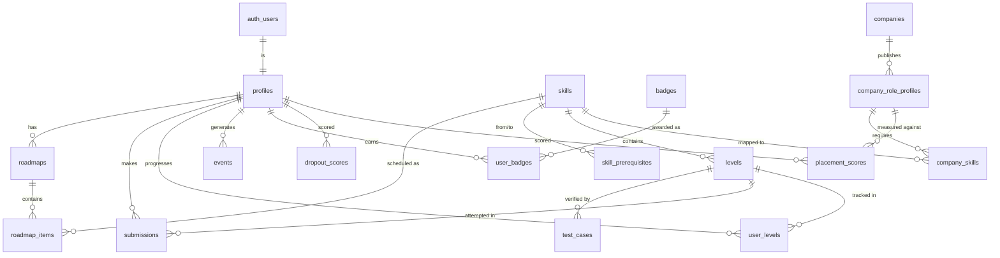

# SkillQuest — Backend Schema

| | |
|---|---|
| **Version** | 1.1 — review corrections: atomic XP, integrity constraints, JD provenance, reproducibility metadata, research participation |
| **Depends on** | [02-TRD.md](02-TRD.md) (Supabase Postgres + Prisma), [03-APP-FLOW.md](03-APP-FLOW.md) (what data each screen needs) |
| **Purpose** | The Postgres schema — tables, relationships, indexes, and the reasoning behind them. This is what Prisma migrations implement. |

---

## 1. Overview

PostgreSQL on Supabase. Auth lives in Supabase's managed `auth.users` table (we don't touch it); everything else is our `public` schema. Access is via **Prisma** from the Web API and **psycopg + pandas** from the AI service. Row Level Security is enabled on all tables with **no public policies** — the browser's anon key can read nothing; all data flows through the Web API using the service role.

Design rules:
- **UUIDs** for user-facing IDs (`profiles.id` mirrors `auth.users.id`); `bigint identity` for high-volume internal tables (`events`, `submissions`).
- **`snake_case`** columns (Postgres convention; Prisma maps to camelCase in JS via `@map`).
- **Timestamps** are `timestamptz`, default `now()`. Every table has `created_at`; mutable tables also `updated_at`.
- Skill content (levels, test cases) is authored as JSON in `content/` and loaded by a **seed script** — the DB is the runtime source, the JSON is the versioned source of truth.

## 2. Entity Relationship Diagram



## 3. Tables

### 3.1 `profiles` — the user (1:1 with `auth.users`)
```sql
create table profiles (
  id            uuid primary key references auth.users(id) on delete cascade,
  email         text not null,
  full_name     text,
  college       text,
  branch        text,
  year          int,
  skill_level   text default 'beginner'
    check (skill_level in ('beginner','intermediate','advanced')),
  hours_per_week int default 5 check (hours_per_week between 1 and 40),
  goal_text      text,                          -- raw free-text goal
  goal_category  text,                          -- AI-mapped category
  total_xp       int not null default 0 check (total_xp >= 0),
  current_streak int not null default 0 check (current_streak >= 0),
  best_streak    int not null default 0 check (best_streak >= 0),
  last_active_date date,
  onboarding_step int not null default 0 check (onboarding_step between 0 and 5),
  risk_tier      text default 'healthy'
    check (risk_tier in ('healthy','watch','atrisk')),
  is_admin       boolean not null default false,
  -- research participation (see §5.1)
  consent_version    text,
  consent_given_at   timestamptz,
  withdrawn_at       timestamptz,
  created_at     timestamptz not null default now(),
  updated_at     timestamptz not null default now()
);

-- Target companies as a real relation, not an unconstrained text[]
create table user_target_companies (
  user_id    uuid not null references profiles(id) on delete cascade,
  company_id text not null references companies(id) on delete cascade,
  primary key (user_id, company_id)
);
```
`year` uses `check (year between 1 and 4)`. `total_xp`, `current_streak`, `risk_tier` are **denormalized** from events/scores for fast dashboard reads.

**Drift control for cached fields.** Denormalized rollups can drift from their source records (a failed transaction, a manual DB edit, a bug). Two safeguards: (1) every cached field is only ever written inside the same transaction as its source record — never in a separate call; (2) a `/internal/jobs/reconcile` endpoint recomputes `total_xp`, `current_streak` and `best_streak` from `events` + `user_levels` and logs any mismatch. Run it before UAT and before the final demo — a leaderboard that disagrees with a student's own XP history is the kind of thing that gets noticed in a viva.

### 3.2 `skills` — the DAG nodes
```sql
create table skills (
  id               text primary key,            -- 'recursion', 'loops' (human-readable, stable)
  title            text not null,
  description      text,
  concept_type     text not null,               -- 'conceptual' | 'practical' (informs level style)
  estimated_minutes int not null default 60,     -- for roadmap bin-packing
  display_order    int not null default 0,
  created_at       timestamptz not null default now()
);
```

### 3.3 `skill_prerequisites` — the DAG edges
```sql
create table skill_prerequisites (
  skill_id      text not null references skills(id) on delete cascade,
  prereq_id     text not null references skills(id) on delete cascade,
  primary key (skill_id, prereq_id),
  check (skill_id <> prereq_id)
);
```
The roadmap generator (TRD §6.2) topologically sorts skills using these edges. A `check` prevents self-loops; the seed script must validate the whole graph is acyclic before loading.

### 3.4 `levels` — the playable content
```sql
create table levels (
  id             text primary key,             -- 'recursion-03'
  skill_id       text not null references skills(id) on delete cascade,
  title          text not null,
  difficulty     int not null default 1,       -- 1..5, ordering within a skill
  statement_md   text not null,                -- problem statement (markdown)
  starter_code   text not null,                -- Java scaffold with public class Main
  reference_solution text,                      -- authors' solution (never sent to client)
  hints          text[] default '{}',           -- ordered; each costs XP
  xp_reward      int not null default 50,
  time_limit_ms  int not null default 5000,     -- Judge0 CPU limit
  published      boolean not null default false,
  order_in_skill int not null default 0,
  created_at     timestamptz not null default now()
);
```

### 3.5 `test_cases` — Judge0 verification
```sql
create table test_cases (
  id            bigint generated always as identity primary key,
  level_id      text not null references levels(id) on delete cascade,
  stdin         text not null default '',
  expected_output text not null,
  is_hidden     boolean not null default false,  -- hidden cases: pass/fail only to client
  weight        int not null default 1,
  ordinal       int not null default 0,
  unique (level_id, ordinal)
);
```
**Security-critical:** the Web API strips `expected_output` and hidden-case data before responding to the client (TRD §5). Only pass/fail leaks for hidden cases.

### 3.6 `roadmaps` & `roadmap_items` — the personalized plan
```sql
create table roadmaps (
  id          bigint generated always as identity primary key,
  user_id     uuid not null references profiles(id) on delete cascade,
  generated_at timestamptz not null default now(),
  is_active   boolean not null default true,     -- regenerated on hours/week change
  params      jsonb                              -- snapshot of inputs (level, hours, goal) for reproducibility
);
-- exactly one active roadmap per user
create unique index one_active_roadmap_per_user
  on roadmaps(user_id) where is_active;

create table roadmap_items (
  id          bigint generated always as identity primary key,
  roadmap_id  bigint not null references roadmaps(id) on delete cascade,
  skill_id    text not null references skills(id),
  week_number int not null check (week_number > 0),
  position    int not null,                      -- order within the week
  status      text not null default 'locked'
    check (status in ('locked','current','completed')),
  unique (roadmap_id, skill_id),
  unique (roadmap_id, week_number, position)
);
```
Regenerating a roadmap (hours/week change) marks the old one `is_active=false` and inserts a new one — history preserved for the report; completed-node status carries over.

### 3.7 `user_levels` — per-level progress
```sql
create table user_levels (
  user_id      uuid not null references profiles(id) on delete cascade,
  level_id     text not null references levels(id) on delete cascade,
  status       text not null default 'locked'
    check (status in ('locked','unlocked','completed')),
  best_pass_ratio numeric not null default 0 check (best_pass_ratio between 0 and 1),
  hints_used   int not null default 0 check (hints_used >= 0),
  attempts     int not null default 0 check (attempts >= 0),
  completed_at timestamptz,
  primary key (user_id, level_id)
);
```
Drives the "Code Master" badge (completed with `hints_used = 0`) and feeds `completion_ratio` / `avg_score` risk features.

**Awarding XP must be atomic.** The primary key alone does *not* prevent double XP: two concurrent "all tests passed" requests both read `status = 'unlocked'` and both award. Guard the reward on a **conditional state transition**, inside one transaction:

```sql
begin;

-- Only one concurrent request can win this update.
update user_levels
   set status = 'completed', completed_at = now()
 where user_id = $1 and level_id = $2 and status <> 'completed'
returning *;
-- 0 rows returned -> already completed -> commit and award nothing.

-- Only if the update returned a row:
update profiles set total_xp = total_xp + $3 where id = $1;
insert into events (user_id, type, payload) values ($1, 'level_complete', $4);
-- badge checks + next-level unlock here, same transaction

commit;
```

The same rule applies to every rewarded action (badges via the `user_badges` PK, daily-login XP via a `(user_id, date)` uniqueness check). Replaying a request must never mint XP twice — beyond fairness, XP and completion feed the risk model's features, so duplicates corrupt the ML inputs as well as the leaderboard.

### 3.8 `submissions` — every code run
```sql
create table submissions (
  id           bigint generated always as identity primary key,
  user_id      uuid not null references profiles(id) on delete cascade,
  level_id     text not null references levels(id) on delete cascade,
  source_code  text not null,
  pass_ratio   numeric not null default 0 check (pass_ratio between 0 and 1),
  verdict      text not null
    check (verdict in ('accepted','wrong_answer','compile_error','runtime_error','timeout')),
  runtime_ms   int,
  created_at   timestamptz not null default now()
);
```
Append-only. Capped at 64 KB source (TRD §5). High volume → `bigint` id, indexed on `(user_id, created_at)`.

**Source-code retention:** student code is personal research data. Keep the **latest accepted submission per (user, level) plus the 20 most recent attempts per user**; older `source_code` bodies are nulled (the row, verdict and pass_ratio are kept, since those are the ML features). Documented in the consent text (§5.1) with the retention period.

### 3.9 `events` — the behavioral backbone (TRD §7)
```sql
create table events (
  id       bigint generated always as identity primary key,
  user_id  uuid not null references profiles(id) on delete cascade,
  type     text not null,                        -- login|level_start|level_submit|level_complete|hint_used|streak_break|badge_earned|roadmap_view|onboarding_step
  payload  jsonb not null default '{}',
  ts       timestamptz not null default now()
);
create index idx_events_user_ts on events(user_id, ts);
```
Weekly dropout features are one `GROUP BY user_id` over this table — the whole reason Postgres was chosen over Firestore.

### 3.10 `badges` & `user_badges`
```sql
create table badges (
  id          text primary key,                 -- 'first_quest','week_warrior','code_master','placement_ready'
  title       text not null,
  description text not null,
  icon        text,                             -- emoji or asset key
  criteria    text                              -- human description of unlock rule
);

create table user_badges (
  user_id    uuid not null references profiles(id) on delete cascade,
  badge_id   text not null references badges(id) on delete cascade,
  earned_at  timestamptz not null default now(),
  primary key (user_id, badge_id)
);
```
Badge rules live in Web API code (evaluated on relevant events), not the DB — the `badges` table is the catalog.

### 3.11 `companies` & `company_skills` — placement scoring source
```sql
create table companies (
  id          text primary key,                 -- 'infosys','tcs','wipro','accenture','cognizant'
  name        text not null,
  logo        text
);

-- One row per role profile per company, versioned and citable.
create table company_role_profiles (
  id            bigint generated always as identity primary key,
  company_id    text not null references companies(id) on delete cascade,
  role_title    text not null,                  -- 'Systems Engineer', 'Programmer Analyst'
  location      text,                           -- 'India', 'Bangalore'
  source_url    text not null,                  -- the public JD we curated from
  collected_on  date not null,                  -- when we read it (JDs change)
  profile_version int not null default 1,
  is_active     boolean not null default true,
  unique (company_id, role_title, profile_version)
);

create table company_skills (
  profile_id  bigint not null references company_role_profiles(id) on delete cascade,
  skill_id    text not null references skills(id) on delete cascade,
  weight      numeric not null default 1 check (weight > 0),
  jd_phrase   text,                             -- original JD wording, for the report
  is_tracked  boolean not null default true,    -- false = requirement SkillQuest does not teach yet
  primary key (profile_id, skill_id)
);
```
**Provenance is required, not optional:** every score in the report traces to a `source_url` + `collected_on` + `profile_version`, so an examiner asking "where did these requirements come from?" gets a citation. Re-curating a JD creates a new `profile_version` rather than editing rows, keeping past scores reproducible.

**No embedding column.** JD-phrase → `skill_id` mapping is done once during ingestion (embedding similarity suggests, a human confirms), so the runtime score is deterministic weighted-coverage arithmetic (TRD §6.4). `is_tracked = false` marks genuine role requirements outside our Java+DSA track — these appear in the gap list as informational rows with no "Train this" action.

### 3.12 `dropout_scores` & `placement_scores` — AI outputs (history)
```sql
create table dropout_scores (
  id          bigint generated always as identity primary key,
  user_id     uuid not null references profiles(id) on delete cascade,
  probability numeric not null check (probability between 0 and 1),
  tier        text not null check (tier in ('healthy','watch','atrisk')),
  features    jsonb not null,                    -- exact feature row scored
  -- reproducibility: a number in the report must be traceable to a model + window
  model_version           text not null,         -- e.g. 'rf-v3-2026-08-14'
  feature_set_version     text not null,
  threshold_version       text not null,
  observation_window_start date not null,
  observation_window_end   date not null,
  prediction_horizon_days  int  not null,
  scored_at   timestamptz not null default now(),
  unique (user_id, observation_window_end, model_version)   -- idempotent weekly job
);

create table placement_scores (
  id            bigint generated always as identity primary key,
  user_id       uuid not null references profiles(id) on delete cascade,
  profile_id    bigint not null references company_role_profiles(id) on delete cascade,
  score         int not null check (score between 0 and 100),
  missing_tracked_skills  text[] default '{}',   -- gaps we teach -> "Train this"
  missing_external_skills text[] default '{}',   -- gaps we don't teach -> informational
  computed_at   timestamptz not null default now()
);
```
Kept as **history** (not overwritten) so the report can chart "risk over time" and "coverage growth" — headline graphs for the viva. The `profiles.risk_tier` column caches the latest tier for fast reads.

The version + window columns are what make a reported figure defensible: given any chart in the report, you can point to the exact model, feature definition, threshold and date range that produced it. The `unique (user_id, observation_window_end, model_version)` constraint also makes the weekly job idempotent — a retry or double-fire cannot create duplicate scores.

### 3.13 `quiz_attempts` & `nudges` — evidence for claims we make

```sql
create table quiz_attempts (
  id            bigint generated always as identity primary key,
  user_id       uuid not null references profiles(id) on delete cascade,
  question_id   text not null,
  question_version int not null,
  topic_skill_id text not null references skills(id),
  chosen_option int not null,
  is_correct    boolean not null,
  answered_at   timestamptz not null default now()
);

create table nudges (
  id             bigint generated always as identity primary key,
  user_id        uuid not null references profiles(id) on delete cascade,
  dropout_score_id bigint references dropout_scores(id),  -- which prediction triggered it
  variant        text not null,                 -- message/booster variant
  suggested_level_id text references levels(id),
  shown_at       timestamptz,
  clicked_at     timestamptz,
  dismissed_at   timestamptz
);
```

`quiz_attempts` makes test-out decisions reproducible and lets the report evaluate the quiz itself (App Flow §2). `nudges` exists because App Flow §5 claims we measure whether interventions land — **if we keep that claim, we must log the evidence.** With n≈30 this supports reporting interaction rates only (shown/clicked/dismissed), never causal effectiveness.

## 4. Indexes (beyond primary/foreign keys)

| Table | Index | Why |
|---|---|---|
| `events` | `(user_id, ts)` | Weekly feature aggregation, streak calc |
| `submissions` | `(user_id, created_at)` | Progress history, rate-limit checks |
| `submissions` | `(level_id)` | Per-level analytics |
| `user_levels` | `(user_id, status)` | Dashboard "in progress" queries |
| `placement_scores` | `(user_id, profile_id, computed_at desc)` | Latest coverage per role profile |
| `dropout_scores` | `(user_id, scored_at desc)` | Latest tier + trend |
| `roadmap_items` | `(roadmap_id, week_number, position)` | Ordered roadmap render |
| `company_role_profiles` | `(company_id, is_active)` | Active profile lookup during scoring |

## 5. Row Level Security

```sql
alter table profiles enable row level security;
-- ...and every other table
-- No public policies. The anon/authenticated browser roles get nothing.
```
The Web API connects using its own **PostgreSQL role** (`skillquest_api`, TRD §4.2) — a database user with a password, *not* the Supabase service-role API key, which belongs to Supabase's REST/JS client that we don't use server-side. Table owners' RLS does not apply to the owner role, so authorization is enforced in application code (owner checks, `is_admin` gates), keeping a single auditable choke point. RLS-on-with-no-policy is the safe default: if the browser's anon key ever leaks, it still reads nothing.

## 5.1 Research Participation (minimal, required)

SkillQuest monitors behaviour, stores student-written code, and reports findings — that is human-subjects research, so a small amount of process is required. This is *not* an enterprise compliance programme; it's roughly one screen, three columns and a paragraph in the report:

| Requirement | Implementation |
|---|---|
| Informed consent | Consent screen before onboarding; store `consent_version` + `consent_given_at` on `profiles` |
| Plain-language disclosure | One short screen: what we collect (activity, code, quiz answers), why (personalization + a research report), how long we keep it, who sees it |
| Withdrawal | "Withdraw from research" in settings → sets `withdrawn_at`; data excluded from all analysis and exports |
| Retention | State a period (e.g. deleted within 6 months of project submission); source code pruned per §3.8 |
| Pseudonymized exports | Research exports/report figures use `participant_01…N`, never names, emails or USNs |
| Institutional approval | Confirm with the project guide whether department/ethics sign-off is needed before UAT — ask in week 1, not week 12 |

Deferred as out of scope: automated opt-out UI beyond the withdraw toggle, generalized deletion workflows, and audit-trail tables.

## 6. Seed & Migration Strategy

- **Migrations:** Prisma (`prisma migrate`) — schema versioned in `backend/prisma/schema.prisma`, migrations committed, applied to `skillquest-dev` first, `skillquest-prod` on release (TRD §9).
- **Seed order** (respects FKs): `skills` → `skill_prerequisites` (validate acyclic) → `levels` → `test_cases` → `badges` → `companies` → `company_role_profiles` → `company_skills` (JD-phrase → skill mapping confirmed by a human here).
- Seed reads from `content/*.json`; idempotent (upsert by id) so re-running is safe.
- `profiles` rows are created on first login by the Web API (from the JWT `sub`), never seeded.

## 7. Storage Budget Check (Supabase free = 500 MB)

At UAT scale (~30 users): profiles/roadmaps/user_levels trivial; `events` ≈ 30 × ~250 rows × ~0.3 KB ≈ 2 MB. `submissions` is the largest table because it stores **every** code attempt, not just completions: ~30 users × ~150 attempts × ~2 KB source ≈ **9 MB** (the earlier estimate omitted source-code bodies). Content a few MB. **Total still well under 100 MB** — capacity is not a semester risk.

The reason to prune source code (§3.8) is therefore **privacy hygiene, not storage pressure** — we keep student-written code only as long as the research needs it.

## 8. Open Items (resolve in Implementation Plan)

1. Final skill list + prerequisite edges for Java + DSA (TRD §10.1) — becomes the `skills`/`skill_prerequisites` seed.
2. ~~Badge evaluation synchronous or hook?~~ **Resolved: synchronous, inside the same transaction as the XP award** (§3.7) — anything asynchronous reintroduces the double-award race.
3. Exact company skill weights — curated by the team from live JDs during content authoring, recorded with source URL + date.
4. Confirm with the project guide whether department ethics approval is required before UAT (§5.1) — resolve in week 1.
